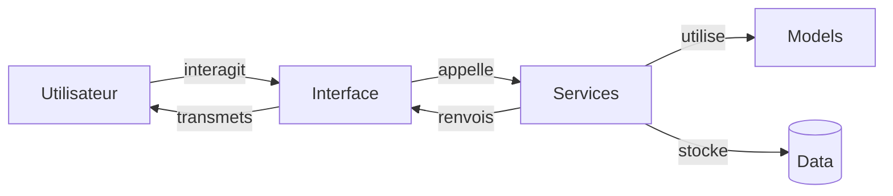

# Projet traitement de données

Votre fichier README.md doit contenir les informations suivantes :  
- Informations sur votre code :  
    - Version de python utilisée    
    - Packages python, dépendances et versions
    - Choix du style docstrings  
    - Choix du linter  
    - Choix du formatter (optionnel)  

- Structure rapide de votre code 

- Commande d'éxécution de votre code  
    - Création d'un environnement virtuel   
    - Lancement de votre application
    - Commandes correspondantes aux tests  

## Schéma de relations entre les modules

