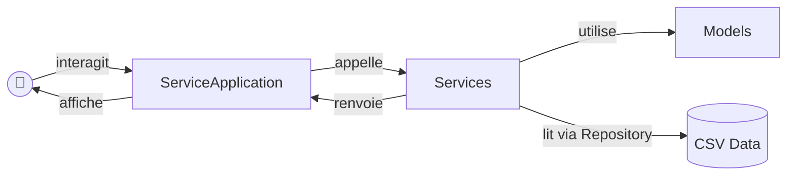

# Tableau de Bord Multisports 🏆

Application de traitement et de visualisation de données sportives, couvrant la **NBA** (basket) et le **Tennis** (circuits ATP et WTA).

---

## Informations techniques

### Version de Python
- **Python 3.12**

### Dépendances et outils

| Package        | Rôle                                                                 |
|----------------|----------------------------------------------------------------------|
| `pandas`       | Lecture et manipulation des fichiers CSV                             |
| `pytest`       | Framework de tests unitaires                                         |
| `pytest-cov`   | Mesure de la couverture de code des tests                            |
| `black`        | Formateur de code automatique (PEP 8 strict)                         |
| `ruff`         | Linter ultra-rapide écrit en Rust (remplace Flake8 et isort)         |
| `mypy`         | Vérificateur de typage statique                                      |
| `pandas-stubs` | Fichiers de traduction de types pour la compatibilité Mypy x Pandas  |

### Style de docstrings
Convention **NumPy** (`pydocstyle`) — chaque classe et méthode est documentée avec une description, la liste des paramètres (`Parameters`) et la valeur de retour (`Returns`).

### Qualité du code
- **Linter (Ruff) :** Détection et correction automatique des erreurs de syntaxe, imports inutilisés, etc.
- **Formatter (Black) :** Formatage automatique du code (longueur de ligne : 88 caractères).  
- **Typage statique (Mypy) :** Vérification stricte des *Type Hints* pour assurer la robustesse des fonctions.

---

## Structure du projet

```text
projet/
├── main.py                          # Point d'entrée de l'application
├── pyproject.toml                   # Configuration des dépendances et outils
├── README.md
│
├── pkg/                             # Package principal
│   ├── __init__.py                  # Initialisation du module (requis par Mypy)
│   ├── models/                      # Modèles métier (entités)
│   │   ├── __init__.py
│   │   ├── joueur.py                # Joueur, JoueurBasket, JoueurTennis
│   │   ├── equipe.py                # Equipe
│   │   └── match.py                 # Match
│   │
│   ├── adapter/                     # Transformation CSV → objets métier
│   │   ├── __init__.py
│   │   ├── base_adapter.py          # Classe abstraite BaseAdapter
│   │   ├── generic_joueur_adapter.py # BasketJoueurAdapter, TennisJoueurAdapter
│   │   ├── generic_equipe_adapter.py # GenericEquipeAdapter
│   │   └── generic_match_adapter.py  # GenericMatchAdapter, TennisMatchAdapter
│   │
│   ├── repository/                  # Accès aux données (lecture/écriture CSV)
│   │   ├── __init__.py
│   │   └── data_repository.py       # DataRepository (via pandas)
│   │
│   ├── config/                      # Configurations des datasets
│   │   ├── __init__.py
│   │   └── dataset_configuration.py # Configs NBA et Tennis (chemins, séparateurs, adapters)
│   │
│   └── services/                    # Logique métier
│       ├── __init__.py
│       ├── service_application.py   # Interface utilisateur (menus, navigation)
│       ├── service_statistiques.py  # Calcul des classements et statistiques
│       ├── service_annuaire_joueur.py # Annuaire et recherche de joueurs
│       └── services_matchs.py       # Gestion et affichage des matchs
│
└── tests/                           # Tests unitaires
    ├── test_models.py               # Tests des modèles métier
    ├── test_adapters.py             # Tests des adapters et du repository
    └── test_services.py             # Tests de la logique métier

--

## Schéma de relations entre les modules



---

## Commandes d'exécution

### 1. Créer et activer un environnement virtuel

```bash
# Créer l'environnement virtuel
python -m venv .venv

# Activer (macOS / Linux)
source .venv/bin/activate

# Activer (Windows)
.venv\Scripts\activate
```

### 2. Installer les dépendances

```bash
pip install pandas pytest pytest-cov black ruff mypy pandas-stubs
```

### 3. Lancer l'application

```bash
python -m main.py
```

### 4. Lancer les tests

```bash
# Lancer tous les tests
pytest -v

# Lancer tous les tests avec affichage court
pytest -ra -q

# Lancer un fichier de test spécifique
pytest tests/test_models.py -v
pytest tests/test_adapters.py -v
pytest tests/test_services.py -v
```

### 5. Mesurer la couverture de code

```bash
# Couverture complète avec rapport dans le terminal
python -m pytest --cov=pkg tests/ -W ignore

# Générer un rapport HTML détaillé pour voir les lignes non testées
python -m pytest --cov=pkg --cov-report=html -W ignore

# Formater le code automatiquement
python -m black pkg/

# Corriger automatiquement les erreurs de syntaxe et imports inutiles
python -m ruff check --fix pkg/

# Vérifier la stricte conformité du typage statique
python -m mypy pkg/
```