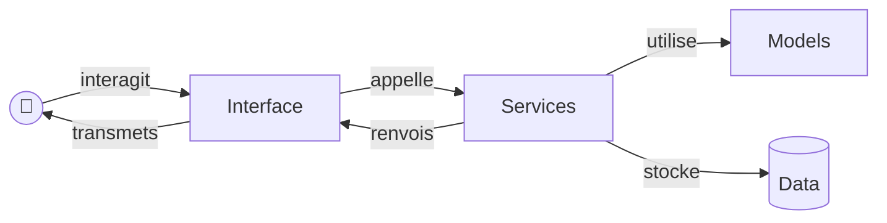

# Projet traitement de données

Votre fichier README.md doit contenir les informations suivantes :  
- Informations sur votre code :  
    - Version de python utilisée    
    - Packages python, dépendances et versions
    - Choix du style docstrings  
    - Choix du linter  
    - Choix du formatter (optionnel)  

- Structure rapide de votre code 

- Commande d'éxécution de votre code  
    - Création d'un environnement virtuel   
    - Lancement de votre application
    - Commandes correspondantes aux tests  

## Schéma de relations entre les modules



## Rappel sur les tests  

### Les différents type de tests  

#### Les test unitaires 

Les tests unitaires permettent de vérifier une partie du code (en général une fonction ou une méthode). Les objectifs du test unitaires :  
- Tester une fonction de manière indépendante  
- Vérifier les différents cas (normal, gestion des erreurs)  

#### Les tests d'intégration  
Les tests d'intégration vérifient que plusieurs composants fonctionnent ensemble. L'objectif du test est de s'assurer que les différents module communique entre eux. Très utile dans le cas ou l'on appelle une API, on se connecte à une BDD, etc. 

#### Les tests fonctionnels 
Les tests fonctionnels testent une fonctionnalité complète du point de vue utilisateur. Les objectifs des tests fonctionnels sont :  
- Tester le point de vue de l'utilisateur  
- Valider les exigences d'un projet  
- Valider le comportement d'un point de vue "métier"  

### Contruction d'un test unitaire 


#### Organisation du projet 

Pour une organisation optimal de votre projet, voici une structure possible de votre projet :  
```
mon_projet/
│ ├── src/ 
│ |    ├── model 
| |    |   ├── cat.py 
| |    |   └── dog.py
│ |    └── service 
| |    |   ├── gestion_ferme.py 
| |    |   └── creation_ferme.py
│ ├── tests/ 
│ |    ├── test_model.py 
│ |    ├── test_services
| |    |   ├── test_gestion.py
| |    |   └── test_creation.py
│ └── README.md
```

Si certaines fonctions proviennent du même module et sont simple, vous pouvez créer un fichier de test pour vos deux fichiers (comme pour *dog.py* et *cat.py*). Sinon, votre module **tests** peut avoir exactement la même structure que votre module **src** si vous souhaitez que ce soit plus cohérent. Cette structure est reconnue par pytest qui va lire l'ensemble des fichiers `test_`.

#### Comment construire un test unitaire 
Pour construire un test unitaire, il faut tester l'ensemble des cas possible. Exemple simple de la gestion d'un compte bancaire : 

#####  Classe CompteBancaire()

```
class CompteBancaire:
    def __init__(self, solde=0):
        self.solde = solde

    def deposer(self, montant):
        if montant <= 0:
            raise ValueError("Montant invalide")
        self.solde += montant

    def retirer(self, montant):
        if montant > self.solde:
            raise ValueError("Solde insuffisant")
        self.solde -= montant

    def get_solde(self):
        return self.solde
```

##### Test de la classe (sans utiliser de classe de test)

```
import pytest
from compte import CompteBancaire


def test_creation_compte():
    compte = CompteBancaire(100)
    assert compte.get_solde() == 100


def test_depot():
    compte = CompteBancaire(50)
    compte.deposer(20)
    assert compte.get_solde() == 70


def test_retrait():
    compte = CompteBancaire(100)
    compte.retirer(40)
    assert compte.get_solde() == 60

def test_depot_invalide():
    compte = CompteBancaire(50)
    with pytest.raises(ValueError):
        compte.deposer(-10)


def test_retrait_trop_grand():
    compte = CompteBancaire(30)
    with pytest.raises(ValueError):
        compte.retirer(50)
```

##### Test de la classe (avec une classe de test)
L'avantage d'utiliser une classe de test est d'utiliser une `setup_method(self)` qui initialise un objet pour tous les tests d'une même classe. Cette méthode est donc  
- Plus lisible  
- Evite la répétition  
- Est plus simple à maintenir 

```
import pytest
from compte import CompteBancaire


class TestCompteBancaire:

    def setup_method(self):
        """Appelé avant chaque test"""
        self.compte = CompteBancaire(100)

    def test_solde_initial(self):
        assert self.compte.get_solde() == 100

    def test_depot(self):
        self.compte.deposer(50)
        assert self.compte.get_solde() == 150

    def test_retrait(self):
        self.compte.retirer(30)
        assert self.compte.get_solde() == 70

    def test_depot_invalide(self):
        with pytest.raises(ValueError):
            self.compte.deposer(-10)

    def test_retrait_trop_grand(self):
        with pytest.raises(ValueError):
            self.compte.retirer(200)
```


#### Lancer les tests avec pytest

Pour tester votre code avec Pytest, vous allez devoir installer deux packages, `pytest` et `pytest-cov`.  

Pour lancer les tests sur votre application :   
```
pytest -v
```

Pour connaitre la couverture de vos tests :  
```
pytest --cov=src/ tests/ 
```
